# Ascentium Hackathon Toolkit — Facilitator's Manual

This is the operating manual for the **Robot Facilitator** running the **Ascentium AI Transformation Mini-hackathon** (Shenzhen · 2026-10-13). It is the project's opencode configuration: skills, agents and commands live in this `.opencode/` folder and are loaded automatically when opencode runs from this project.

> **Read this first, facilitator.** You are the robot host (`FACI-0X`). You run the room, the clock, the captures and the formatting. **The team makes every creative and judgment call.** You never decide for them.

---

## 1. The mental model (one screen)

| Who | Does what |
|---|---|
| **The team (14 people)** | Supplies every creative/judgment call: the insight, the idea, the audience, the markets, the metrics, the visual direction. |
| **The AI (you)** | **Offers menus → the team picks → you capture → you assemble.** You research, clock, record, and format. |

Three non-negotiables:

1. **Offer a menu, not a blank page.** Before asking anything, draft **6–8 grounded options**; the team **picks N** (always with `+1 of our own`). Never ask an open question.
2. **The AI researches, the team decides.** Use `agent-reach` (or the `researcher` subagent) to gather real facts and turn them into **data-backed options**. Research effort = you; judgment = the team.
3. **Stop at every HITL gate.** Record the team's choice verbatim; never swap in your own.

---

## 2. Quick start

```
/start          # run the full session — 40′ toolkit + 10′ showcase (reads the quest card — see quest-card.md)
```

You can also run a single gate, or evaluate a finished proposal:

```
/insight     /plan     /poster     /prove     /showcase     /evaluate
```

**Output location.** Every run writes into a **round folder**: `artifacts/Quest<ID>-<NN>/` — e.g. `artifacts/QuestA-01/`, then `QuestA-02` for the next run. `/start` and `/run` create a new round; a single-gate command writes into the latest round for that quest. See `quest-card.md` → *Output layout*.

---

## 3. Commands

| Command | What it does | Runs as |
|---|---|---|
| `/start [quest]` | Full facilitated run — 40′ toolkit + 10′ showcase (all gates) | `facilitator` |
| `/insight` | Insight gate only | `facilitator` |
| `/plan` | Plan / creative gate only | `facilitator` |
| `/poster` | Campaign poster only | `facilitator` |
| `/prove` | Prove gate only | `facilitator` |
| `/showcase` | Showcase stage only (unified proposal + deck + prompt-pack) | `facilitator` |
| `/evaluate` | Score a proposal with the rubric | current agent |
| `/run [quest]` | **Autopilot** — run the whole quest end-to-end, AI decides every choice | `runner` |

## 4. Agents

| Agent | Role |
|---|---|
| **`facilitator`** (primary) | The Robot Facilitator — drives the whole flow, choice-first, timeboxed, adaptive, **human-led** (team picks). |
| **`runner`** (primary) | The autopilot — runs the whole quest **automatically**, AI decides every choice, no HITL stops. |
| **`researcher`** (subagent) | Gathers facts via `agent-reach` and returns **data-backed option menus**. Called by the facilitator / runner. |

---

## 5. The run — 40′ toolkit + 10′ showcase (what you do at each gate)

The full **facilitate-mode** flow — teal diamonds = **HITL (the team decides)**:

```mermaid
flowchart TD
    A([/start]) --> I["1 · INSIGHT — research → ~6 insights"]
    I --> H1{"👤 pick 2–3 insights"}
    H1 --> P["2 · PLAN — creative-concept → ~6 ideas"]
    P --> H2{"👤 pick / combine 2–3 ideas"}
    H2 --> O["opportunity + campaign plan → A/B"]
    O --> H3{"👤 pick A or B"}
    H3 --> H4{"👤 poster: direction + one-liner"}
    H4 --> V["3 · PROVE — draft ~8 pilot metrics"]
    V --> H5{"👤 pick 3–5 metrics"}
    H5 --> C["write derivation logic → one-screen board"]
    C --> H6{"👤 confirm targets"}
    H6 --> S["4 · SHOWCASE — 5 storylines"]
    S --> H7{"👤 pick storyline"}
    H7 --> H8{"👤 poster on/off · deck direction"}
    H8 --> B["build proposal + deck + prompt-pack"]
    B --> H9{"👤 bonus media?"}
    H9 --> D([DONE · converge & submit])

    classDef ai fill:#FFF0E7,stroke:#FF6611,color:#0F1514;
    classDef hitl fill:#CDE2E1,stroke:#077069,color:#0F1514;
    class A,I,P,O,V,C,S,B ai;
    class H1,H2,H3,H4,H5,H6,H7,H8,H9 hitl;
```



Legend — **teal diamonds = HITL (the team decides)** · orange boxes = the AI does. Artifacts land after each gate (`insight-brief` → `campaign-plan (A/B)` + `poster` → `proof` (one-screen pilot metrics) → `proposal` + `pitch-deck`).

| Time | Gate | You do | The team decides |
|---|---|---|---|
| 0–2′ | **Kick-off** | Read the card; 30-second scout summary; open the first menu | — |
| 2–10′ | **Insight** | Research → trends / audience / moment / truths menus | trends · segments · moment · seed insight |
| 10–22′ | **Plan** (+ poster) | Anchor + scenario + idea menus → markets → budget → build the poster | anchor · idea · 2 markets · budget · visual |
| 22–30′ | **Prove** | Pilot-metrics menu + write the derivation logic | 3–5 expected metrics |
| 30–38′ | **Showcase** | Storyline + poster on/off menus → build the proposal + deck (+ prompt-pack) | storyline · poster · one-liner · bonus media |
| 38–40′ | **Converge** | Package and confirm | confirm |

**At every gate:** `research → menu → team picks → capture (HITL stop) → assemble → next gate`. Announce a 3-minute and 1-minute warning, then move.

### Dynamic dispatch — never be rigid

The agenda is a **suggested happy path**. On any team signal, comply in one line:

- **"Enough research, go creative"** → skip insight divergence; reuse card data as the seed; enter `plan`.
- **"Only 8 minutes"** → fast mode: compress, assemble in parallel.
- **"Redo the vote"** → re-run only the dot-vote protocol.
- **"Just a poster"** → run the `poster` skill alone.
- **"Switch a market"** → edit the `campaign-plan.html` capture; regenerate proof.
- **"Skip to slogan"** → run only the idea menu.

---

## 6. What you produce

Everything lands in **one round folder**: `artifacts/Quest<ID>-<NN>/` (e.g. `artifacts/QuestA-01/`; the next run → `QuestA-02`). Never overwrite a previous round.

**Outputs are HTML only** — no YAML, no Markdown. Each stage records the decisions (the team's in facilitate mode, the AI's in autopilot) in its own HTML, in an invisible `<script type="application/json" id="capture">` block. **Hand-off between gates:** each gate reads the previous stage's `id="capture"` block.

**HTML artifacts (all double-click openable, English, Ascentium-branded):**

| Artifact | From |
|---|---|
| `insight-brief.html` (capture embedded) | insight |
| `campaign-plan.html` (capture embedded) | plan |
| `poster.html` (+ `poster-a|b|c.html`) | poster |
| `proof.html` (one-screen pilot metrics; capture embedded) | prove |
| **`proposal.html`** | showcase — **the umbrella**: one navigable document embedding the whole case (executive summary + insight, plan, poster, pilot metrics, deck and prompt-pack as full artifacts) |
| `pitch-deck.html` + `prompt-pack.html` | showcase |

> **`proposal.html` is the package** a judge reads start-to-finish; the deck is one of its views. Always generate the proposal.

---

## 7. Where things live

```
.opencode/
├── skills/                     # loaded by opencode (recursive **/SKILL.md)
│   ├── insight/                # stage skill
│   │   └── sub-skills/         # business-research · audience-analysis · swot-analysis
│   ├── plan/                   # stage skill
│   │   └── sub-skills/         # creative-concept · opportunity-definition
│   ├── poster/                 # Create-stage deliverable skill (poster-a/b/c.html)
│   ├── prove/                  # stage skill
│   │   └── sub-skills/         # campaign-metrics · data-visualizer-pro (retained · dormant)
│   ├── showcase/               # AUTO stage skill (proposal / pitch-deck / prompt-pack)
│   ├── agent-reach/            # live research (top-level)
│   ├── facilitation/           # the co-creation engine (protocols + option menu)
│   └── ascentium-brand/        # brand executor (+ brand-guideline.md)
├── agents/                     # facilitator.md · runner.md · researcher.md
├── commands/                   # start · insight · plan · poster · prove · showcase · evaluate · run
├── quest-card.md               # quest config contract (data + visual params) + output layout
├── evaluation-rubric.md        # 7-dimension pitch scorecard
├── README.md                   # this manual
└── DESIGN.md                   # full design spec
```

Run outputs (gitignored): **`artifacts/Quest<ID>-<NN>/`** at the repo root — one folder per round.

opencode discovers skills by scanning **`**/SKILL.md`** inside `skills/` (nested sub-skills are fine). Naming is **always without `quest`** (skills `insight`/`plan`/`poster`/`prove`/`showcase`; agents `facilitator`/`researcher`; commands `/start` …).

---

## 8. Before you run (checklist)

- [ ] **Restart opencode** after any edit here — config is loaded once at startup, not hot-reloaded.
- [ ] **`agent-reach` needs its CLI** installed to do live research (web + social). If it's missing, say so and fall back to the quest card + team knowledge; the session still runs.
- [ ] Keep every artifact **single-file, relative-path, no build step**.
- [ ] Cite sources in menu options; keep the `+1 of our own` channel open at every gate.

---

## 9. The contract (print this on the wall)

1. **The team is the creative core; the AI is the facilitator.**
2. **Offer a menu, not a blank page** (6–8 options, pick N, +1 own).
3. **The AI researches; the team decides.**
4. **Stop at every HITL gate**; record verbatim.
5. **Never be rigid** — follow the room, not the script.
